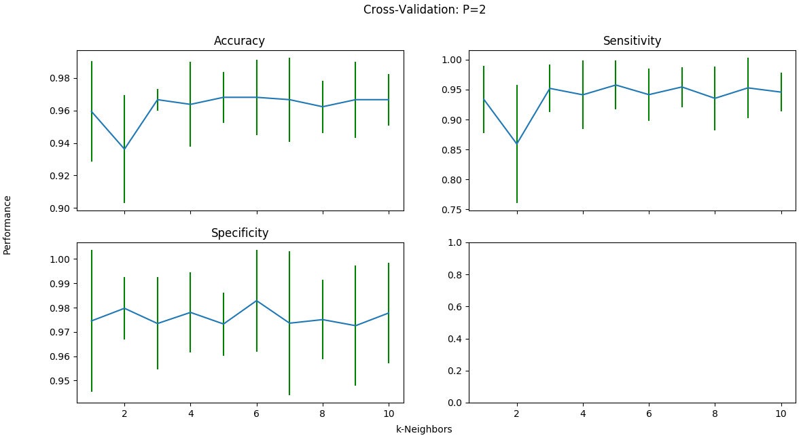

# k-Nearest Neighbors Classifier

This was my first step into the world of learning algorithms. The k-NN classifier is a supervised learning algorithm used to predict labels given a set of attributes. In this case, I used the algorithm to predict whether breast tumors were malignant or benign.

This graph shows the mean and standard deviation for k-neighbors for accuracy, sensitivity, and specificity.

